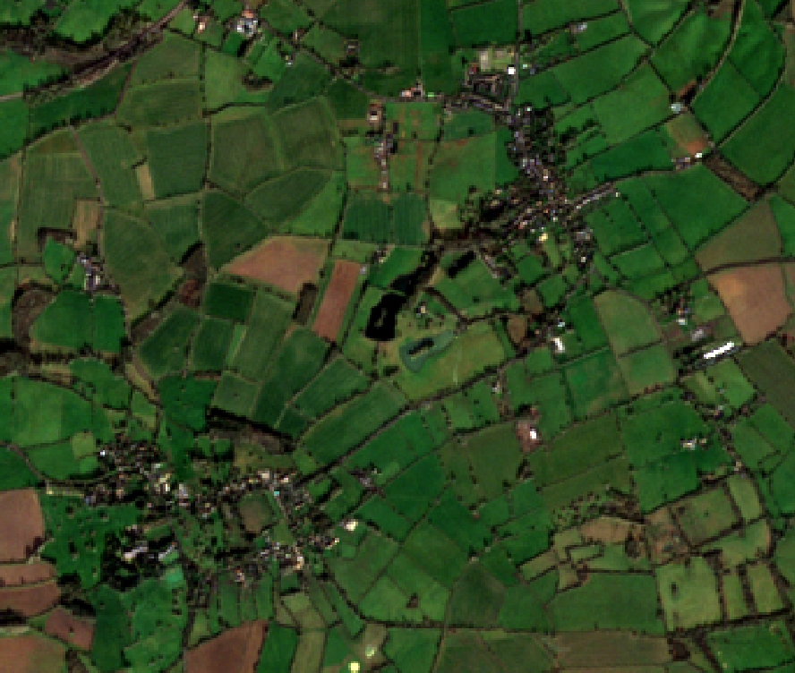
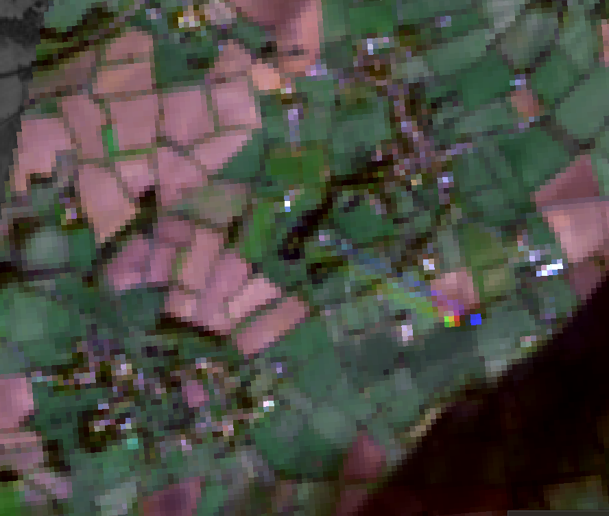

## Content Summary

This week's lecture and practical introduced the fundamental pipeline of Remote Sensing (RS), focusing on how electromagnetic energy reflected from the Earth's surface is recorded and quantified. We explored the "four resolutions" (Spatial, Spectral, Radiometric, and Temporal) as a MECE framework to evaluate data validity. Fundamental to this recording is the physical property of electromagnetic radiation (EMR), which propagates as waves consisting of perpendicular electric and magnetic fields.

However, the path from the sun to the sensor is not a vacuum; EMR interacts significantly with the atmosphere through scattering and absorption. We examined three types of atmospheric scattering: Rayleigh (particles smaller than wavelength), Mie (particles equal to wavelength), and non-selective (particles larger than wavelength). Rayleigh scattering explains why shorter blue wavelengths scatter more easily—a phenomenon that necessitates atmospheric correction to ensure data accuracy. Furthermore, we must account for "atmospheric windows," as molecules like water vapor, ozone, and $CO_2$ block large portions of the spectrum, limiting our observations to specific wavelengths where the atmosphere is transparent. A key takeaway was understanding RS as a dynamic data stream capable of visualizing social inequalities or environmental risks through wavelengths beyond human perception, such as infrared.

In the practical, I utilized QGIS and SNAP to examine the spatial and spectral characteristics of Sentinel-2 and Landsat imagery. The primary focus was constructing a "Virtual Raster" in QGIS. This step was crucial not just for image management, but for understanding that satellite data is a stack of information across various spectral bands rather than a static photograph. A significant portion of the exercise involved comparing Sentinel-2 (10m) and Landsat-8 (30m) (Figure1 & Figure2) resolutions over Central London. At 10m, urban features like street outlines and small parks are clearly identifiable. In contrast, the 30m resolution results in a "Mixed Pixel" phenomenon, where the spectral reflectance of multiple land covers (e.g., concrete and grass) merges into single pixels, obscuring the boundaries of the urban fabric. Later, I used SNAP's Spectrum View to analyze "Spectral Signatures," specifically identifying the "Red-edge" effect in vegetation. This sharp increase in Near-Infrared (NIR) reflectance provides the logical basis for automated land-cover classification.

::: {layout-ncol="2"}
{#fig-sentinel}

{#fig-landsat}
:::

## Applications

This week’s introduction to remote sensing highlights how spatial and spectral resolution transition from theoretical concepts to vital tools for environmental justice. I have selected two studies that demonstrate this transition through contrasting scales.

**Comparison of Macro and Micro Perspectives:**

Wolch, J.R.(@wolch2014) provide a macro-level perspective, arguing that urban greening can paradoxically lead to "environmental gentrification" and the displacement of low-income residents. This demonstrates that time-series RS data is a crucial indicator for capturing broad social dynamics over decades. In contrast, Gascon (@gascon2016) focus on a micro-level perspective regarding individual health. Here, the 10m resolution of Sentinel-2 is indispensable. Unlike the 30m resolution of Landsat, this technology captures "micro-scale greenery" like street trees and pocket parks. These elements were previously "invisible" to sensors but are essential for understanding daily human exposure to nature.

**Synthesis and Future Implementation:**

Integrating these perspectives shows that high spatial resolution is a requirement for environmental justice rather than a technical luxury. By overlaying high-resolution environmental indicators with demographic data, we can logically visualize the "green gap" in vulnerable neighborhoods. This synthesis of macro-social trends (gentrification) and micro-spatial precision (exposure) is central to my own research interests. I intend to apply this dual-scale approach to future projects, possibly examining urban inequality in London or rapidly developing cities in Southeast Asia, where fine-grained resource distribution is the key to effective policy interventions.

## Reflection

Coming from an undergraduate background rooted in qualitative field surveys and interviews, transitioning to orbital remote sensing has been a profound shift in perspective. My previous work always prioritized the "human scale"—the lived experience of the city that exists beneath the resolution of any satellite. This practical forced me to think critically about how digital pixels can either support or obscure these human stories.

The comparison between 10m and 30m imagery made the "fragility of truth" clear. If an urban planner relies only on 30m data, they risk ignoring the very micro-spaces that define daily life for residents. This realization bridges my previous interest in qualitative social justice with the objective power of RS: high-resolution data is a tool for visibility. Furthermore, the technical friction I faced with SNAP 13.0—specifically the "Invalid OpenJpeg" error which forced me to investigate terminal-based workarounds and eventually pivot to QGIS—was a valuable lesson in "Technical Resilience." It shifted my view of software from a "black box" to a complex ecosystem of dependencies. This struggle taught me that analytical integrity is maintained not by a perfect tool, but by the researcher's ability to adapt when tools fail.

Ultimately, this week confirms the principle of "People over Pixels." While 10m imagery bridges the gap to reality, it remains a proxy. I now believe that the most powerful persuasion in urban policy comes from combining the qualitative energy of the field with the logical, multiscale evidence provided by remote sensing. I am eager to explore Google Earth Engine later this term to see if it can offer a more flexible middle ground between high-level computation and practical urban application.

## References

------------------------------------------------------------------------
