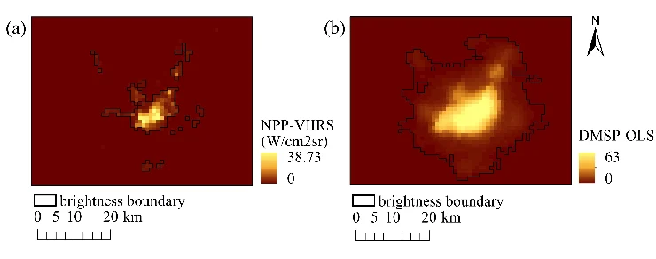

```{r setup, include=FALSE}
library(xaringanthemer)

style_duo_accent(
primary_color      = "#2D5A27", 
  secondary_color    = "#D2691E",
  background_color   = "#F9FBF9",
  text_color         = "#333333",
  header_h1_font_size = "2.25rem", 
  header_h2_font_size = "1.75rem",
  footnote_font_size = "10px",
  extra_css = list(
    "strong" = list("color" = "#D2691E") 
  ),
)
```

# 1. Why VIIRS?

Urban analysis often focuses on the daytime, but the true pulse of a city is revealed at night.

- My background in green space management taught me that local surveys provide depth but lack the "big picture."
- **VIIRS (Visible Infrared Imaging Radiometer Suite)** quantifies urban activity as physical radiance ($nW \cdot cm^{-2} \cdot sr^{-1}$), not just visual brightness.
- I aim to bridge the gap between satellite-derived metrics and on-the-ground reality.
```{r, echo=FALSE, out.width="40%", fig.align='center'}
knitr::include_graphics('img/VIIRS_img4.png')
```

.footnote[.tiny[Source: ponoponosan / PIXTA, *Urban scenery of Hyogo: Night view of Kobe Mayayama Kikuseidai*, item 84004762.]]

---

# 2. What is VIIRS?

VIIRS is a multi-spectral sensor orbiting on Suomi-NPP and NOAA-20/21, succeeding DMSP-OLS with significant improvements.

.pull-left[
- **22 Spectral Bands:** Covers visible to thermal infrared.
- **DNB (Day/Night Band):** Operating at $0.5$ to $0.9\mu m$, capable of measuring light from the moon down to a single streetlamp.
- **Improved Resolution:** 750m per pixel vs. DMSP-OLS's 2.7km, with dramatically reduced saturation in bright urban cores.
- **Daily Global Coverage:** A consistent stream of calibrated radiance data ($nW \cdot cm^{-2} \cdot sr^{-1}$).
]

.pull-right[
```{r, echo=FALSE, out.width="100%"}
knitr::include_graphics('img/VIIRS_img3.png')
```
]


.footnote[.tiny[Source: NASA, *VIIRS Instrument* (NASA PACE Gallery).]]
---

# 3. Limitations

**No sensor is perfect.** To use VIIRS correctly, we must understand its limitations.

- **Spatial Resolution:** At 750m per pixel, the Blooming Effect can cause light diffusion into surrounding dark areas, risking misinterpretation of undeveloped zones as active ones.
- **Saturation:** Extremely bright city centers can overwhelm the sensor, though this is significantly improved over DMSP-OLS.
- **Background Noise:** Light from snow, moonlit clouds, or gas flares can distort the economic signal we seek to measure.

```{r, echo=FALSE, out.width="60%"}

```

.footnote[.tiny[Source: Zhuo et al. (2021), *iSEAM: Improving the Blooming Effect Adjustment for DMSP-OLS Nighttime Light Images by Considering Spatial Heterogeneity of Blooming Distance*; figure via ResearchGate.]]

---

# 4. Regional Application (Macro Analysis)

.large[.brown[**VIIRS as a Regional Determinant of Economic Activity**]]

.pull-left[
**Objective & Methodology:**

To establish a bias-free economic indicator for regions with unreliable or delayed census data, VIIRS DNB radiance is used to model GDP and industrialization. By calculating the **Sum of Lights (SOL)** within administrative boundaries, radiance serves as a high-frequency proxy for the human economic footprint.
]

.pull-right[
**Results & Significance:**

Studies demonstrate a near-linear correlation between radiance intensity and regional electrification rates, enabling continental-scale mapping of urban growth and infrastructure development.
]

---

# 5. Local Application (Micro Calibration)

.large[.brown[**Local Calibration for Quality of Life (QoL) Metrics**]]

.pull-left[
**Objective & Methodology:**

Recognizing that "brightness" does not equate to "quality," this approach integrates global VIIRS metrics with Ground Truth data such as streetlamp GIS maps and community safety surveys. This process is a form of **Decision-level Fusion**, combining satellite-derived indices with locally validated information to distinguish productive infrastructure from wasteful light pollution.
]

.pull-right[
**Results & Significance:**

By training predictive models on localized field data, the accuracy of assessing perceived safety and urban vibrancy significantly increases, transforming a raw economic index into a nuanced tool for improving citizens' Quality of Life.
]

---

# 6. Case Study: Monitoring Resilience during the 2022 Energy Crisis

**Objective & Methodology:**

During the energy crisis in Ukraine, when ground-level reporting was disconnected, VIIRS DNB was deployed to monitor the extent of blackouts and the speed of grid recovery in real time. The objective was to provide spatial evidence for prioritizing humanitarian and engineering resources.

**Results & Significance:**

By identifying specific districts with the slowest recovery rates, authorities were able to allocate resources based on actual resilience performance rather than speculation. This positions VIIRS as a strategic asset for "Informed Maintenance," bridging the gap between orbital observation and urgent on-the-ground action.

---

# 7. Reflection

.pull-left[
## **Knowing VIIRS gives me**

VIIRS introduced me to a new analytical lens: observing human activity through nocturnal radiance. While the DNB's physical precision ($nW \cdot cm^{-2} \cdot sr^{-1}$) makes it a powerful proxy for economic activity, I remain conscious of the Blooming Effect, where light diffusion risks misrepresenting undeveloped areas as economically active zones, reinforcing why Ground Truth validation is essential.
]

.pull-right[
## **What's next by using this technology?**

My goal is to master both the macro-scale overview provided by sensors like VIIRS and the micro-scale validation found on the ground. Looking ahead, combining VIIRS with SAR could enable simultaneous assessment of blackouts and structural damage during disasters, a multi-source approach to resilience analysis that connects directly to the themes explored throughout this Learning Diary.
]

