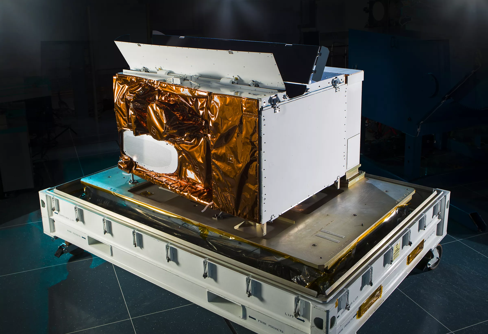

```{r setup, include=FALSE}
library(xaringanthemer)

style_duo_accent(
primary_color      = "#2D5A27", 
  secondary_color    = "#D2691E",
  background_color   = "#F9FBF9",
  text_color         = "#333333",
  extra_css = list(
    "strong" = list("color" = "#D2691E") 
  ),
)
```


<h3 style="font-size: 40px; margin-bottom: 20px;">1. Why VIIRS?</h3>

Urban analysis often focuses on the daytime, but the true pulse of a city is revealed at night.

- My background in green space management taught me that local surveys provide depth but lack the "big picture."

- **VIIRS (Visible Infrared Imaging Radiometer Suite)** allows us to quantify urban activity through radiance, not just visual light.

- I aim to bridge the gap between satellite-derived metrics and on-the-ground reality.

```{r, echo=FALSE, out.width="40%", fig.align='center'}

```

---

<h3 style="font-size: 40px; margin-bottom: 20px;">2. What is VIIRS? </h3>

VIIRS is a multi-spectral sensor orbiting on Suomi-NPP and NOAA-20/21.

.pull-left[

- 22 Spectral Bands: Covers visible to thermal infrared.

- DNB (Day/Night Band): A highly sensitive band capable of measuring light from the moon down to a single streetlamp.

- Daily Global Coverage: Provides a consistent stream of radiance data ($nW \cdot cm^{-2} \cdot sr^{-1}$).
]

.pull-right[
```{r, echo=FALSE, out.width="100%"}

```
]

---

<h3 style="font-size: 40px; margin-bottom: 20px;"> 3. Limitation </h3>
**No sensor is perfect.** To use VIIRS correctly, we must understand its limitations.

- Spatial Resolution: At 750m per pixel, it captures districts, not individual trees or benches.

- Saturation: Extremely bright city centers can "saturate" the sensor, requiring complex calibration.

- Background Noise: Light from snow, moonlit clouds, or gas flares can distort the "Economic" signal we seek to measure.

---

<h3 style="font-size: 40px; margin-bottom: 20px;"> 4. Regional Application (Macro Analysis) </h3>

<span style="font-size: 30px; color: #8B4513; font-weight: bold;"> VIIRS as a Regional Determinant of Economic Activity </span>

.pull-left[
.small[
**Objective & Methodology:**

To establish a bias-free economic indicator for regions with unreliable or delayed census data, VIIRS Day/Night Band (DNB) radiance is utilized to model GDP and industrialization. By calculating the Sum of Lights (SOL) within administrative boundaries, radiance serves as a high-frequency proxy for the human economic footprint.
]
]

.pull-right[
.small[
**Results & Significance:**

Studies by organizations like the World Bank demonstrate a near-linear correlation between radiance intensity and regional electrification rates. This allows for the mapping of urban growth and infrastructure development on a continental scale, positioning VIIRS as a robust determinant for regional-level spatial analysis.
]
]
---

<h3 style="font-size: 40px; margin-bottom: 20px;"> 5. Local Application (Micro Calibration)</h3>

<span style="font-size: 30px; color: #8B4513; font-weight: bold;">Local Calibration for Quality of Life (QoL) Metrics</span>

.pull-left[
.small[
**Objective & Methodology:**

Recognizing that "brightness" does not always equate to "quality," this approach integrates global VIIRS metrics with local "Ground Truth" data, such as streetlamp GIS maps and community safety surveys. This secondary calibration process aims to distinguish between productive infrastructure and wasteful light pollution.
]
]

.pull-right[
.small[
**Results & Significance:**

By using localized field data to train predictive models, the accuracy of Assessing perceived safety and urban vibrancy significantly increases. This demonstrates that satellite data is most effective when calibrated by local context, transforming a raw economic index into a nuanced tool for improving citizens' Quality of Life.
]
]
---

<h3 style="font-size: 40px; margin-bottom: 20px;"> 6. Case Study : Monitoring Resilience during the 2022 Energy Crisis </h3>


**Objective & Methodology:**

During the energy crisis in Ukraine, when ground-level reporting was disconnected, VIIRS DNB was deployed to monitor the extent of blackouts and the speed of grid recovery in real-time. The objective was to provide spatial evidence for prioritizing humanitarian and engineering resources.

**Results & Significance:**

By identifying specific districts with the slowest recovery rates, authorities were able to allocate resources based on actual resilience performance rather than speculation. This proves that VIIRS is a **strategic asset for "Informed Maintenance,"** bridging the gap between orbital observation and urgent on-the-ground action.

---

<h3 style="font-size: 40px; margin-bottom: 20px;"> 7. Reflection </h3>

.pull-left[
<span style="font-size: 30px; color: #8B4513; font-weight: bold;"> Knowing VIIRS gives me: </span>

VIIRS introduced me to a new analytical lens: observing human activity through nocturnal radiance. While light is a powerful visual indicator of development and perceived safety, I am conscious of its constraints. The 750m resolution can lead to "blooming" effects, where **light diffusion might cause us to misinterpret undeveloped areas as active zones**.
]

.pull-right[
<span style="font-size: 30px; color: #8B4513; font-weight: bold;">What's next by using this technology?</span>

My goal is to become an analyst who masters both: **the macro-scale overview** provided by sensors like VIIRS and **the micro-scale validation** found on the ground. By integrating these perspectives, I aim to utilize nighttime lights as a tool to visualize and address economic inequalities within urban environments.
]


