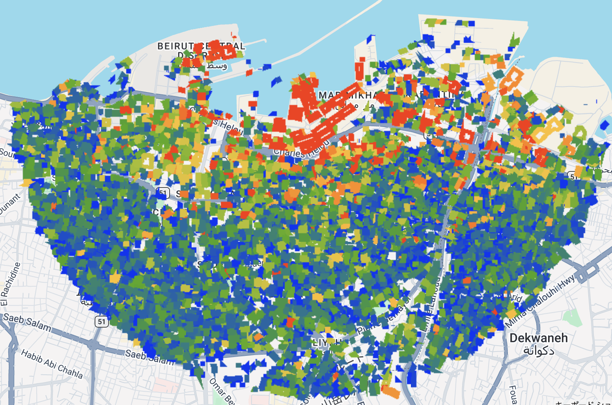
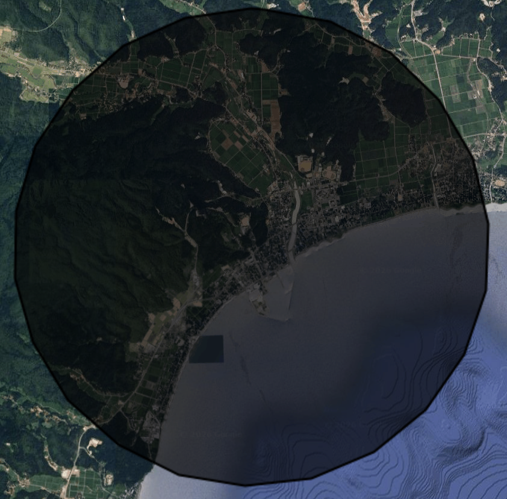
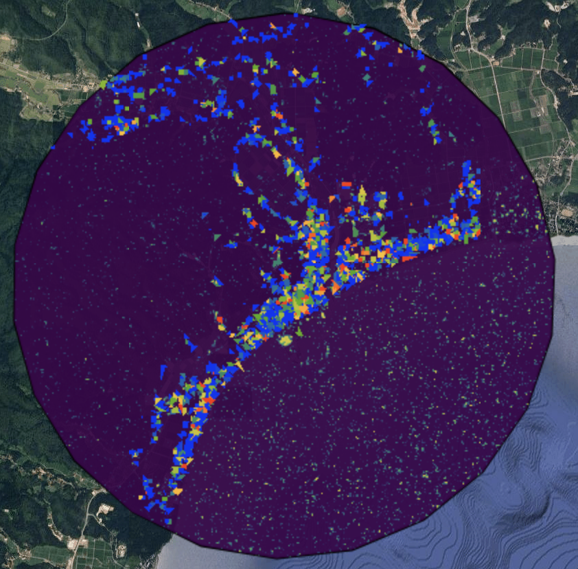

## 1. Summary: SAR-based Change Detection and the Beirut Case Study

The practical focused on the Beirut explosion as a case study for SAR-based damage detection. Instead of relying on a simple before-and-after comparison, the workflow used multiple pre-event and post-event Sentinel-1 images to calculate the mean and standard deviation of each pixel, and then applied a pixel-wise t-test to identify statistically significant change. The lecture also introduced the idea of using ROC curves to evaluate whether change detection results are actually reliable, which made it clear that producing an output map is not enough on its own and that validation matters. 

At the same time, an important limitation was discussed: the assumptions behind a t-test do not always perfectly match the statistical properties of SAR data. I understood this as a reminder that the method is useful, but should not be treated as automatically precise simply because it looks technical.

### Application to Suzu City (Tsunami Damage)
I then tried to apply this same workflow myself to the tsunami-affected coastal area of Suzu City. I was able to generate both a change map and a building-level change map, but the result did not produce a clear and concentrated damage pattern in the same way as the Beirut example. Instead, the mapped changes appeared more as a narrow band along the coastline, around settlements and port areas. 

This made me realise that SAR was not directly showing “damage itself,” but rather highlighting where backscatter had changed significantly. In a tsunami setting, this distinction seems especially important, because damage may involve flooding, internal structural damage, or low-level destruction that does not necessarily appear as a dramatic top-down shape change. For that reason, I came to see SAR as a very effective tool for rapid, broad post-disaster assessment, but not as a definitive map of damage. Its outputs need to be interpreted more carefully as change candidate maps, rather than final damage maps.

## 2. Application: Integration with Other Data Sources

Having worked through this practical, I initially saw SAR-based change detection as a technique that could directly show damage itself. However, I came to feel that it actually functions more as a foundational dataset: it rapidly shows, at a broad spatial scale, where major change has occurred, and in doing so helps guide subsequent investigation and decision-making. This led me to become interested in what SAR is combined with in actual research.

### Combination with Optical Imagery
Looking at the literature, the most typical combination is with optical imagery. SAR is less constrained by weather conditions or time of day, which makes it useful for rapidly identifying change immediately after a disaster, whereas optical imagery allows damage to be understood more intuitively by human observers. In their review, Ge et al. explain that, in disaster-related building damage assessment, SAR offers strengths in spatial coverage, timeliness, and all-weather capability, while also having limitations in terms of visual interpretability, which makes its complementary use with optical imagery especially important. 

I found that this relationship closely matched my own understanding from the practical. In other words, rather than treating SAR as a complete final map on its own, it makes more sense to first use SAR to identify areas of major change and then use optical imagery to examine what the damage actually looks like.

### Combination with Social Media Data (SNS)
Among the many other possible combinations, the one I found most interesting was the use of social data, particularly SNS image data. Satellite imagery is inevitably synoptic: it can show where major change has occurred, but it cannot always fully capture how damage was actually experienced on the ground. In that sense, social media imagery, with its ground-level perspective, seemed especially compelling as a complementary source. 

In their study of Hurricane Dorian, Imran et al. present a framework in which images posted on Twitter were collected for disaster response purposes and then processed through a combination of human and machine classification. What I found especially convincing in this study was the idea that social data can supplement the “on-the-ground view” that cannot be fully seen in synoptic datasets such as SAR. However, filtering and classification are essential, and social data involve issues such as spatial bias and misinformation. It seems most realistic to think of the relationship in the following way: SAR first provides a synoptic indication of where attention should be focused, and then optical imagery or SNS images help explain what was actually happening there.

## 3. Reflection: The Value of SAR in Disaster Management

What stood out to me most this week was that I began to understand SAR not as a technology that produces a complete and final picture of damage, but as a form of foundational information that can support decision-making immediately after a disaster. Before doing the practical, the output of change detection looked to me like it could simply be read as a damage map. However, when I applied the workflow myself to the tsunami-affected area of Suzu, I realised that SAR is really showing statistically significant changes in backscatter, and that interpreting those changes still requires caution. 

At the same time, I do not think this makes the method weak. On the contrary, its value lies in being able to identify broad areas of major change very quickly and indicate where further investigation should be prioritised. In a country like Japan, where earthquakes, tsunamis, and volcanic hazards are constant concerns, I think this makes SAR a highly relevant and necessary technology. If future disasters such as a Nankai Trough earthquake or a Mount Fuji eruption are considered, the ability to gain a rapid synoptic view of likely damage before full ground access is possible seems especially important.

Moreover, the practical also reminded me that satellite data alone can never fully replace on-the-ground understanding. One of the clearest lessons for me was that even a technically impressive SAR output is still not the same thing as reality itself. It can guide attention, but it cannot by itself confirm the full nature of what has happened. For that reason, I think it is essential that remote sensing outputs are always connected back to field observation. What I learned this week was not only the technical potential of SAR, but also the importance of linking large-scale synoptic data with grounded, local evidence.

## Reference
Ge, P., Gokon, H. and Meguro, K. (2020) ‘A review on synthetic aperture radar-based building damage assessment in disasters’, Remote Sensing of Environment, 240, p. 111693. Available at:
Imran, M., Alam, F., Qazi, U., Ofli, F. and Imran, M. (2020) ‘Rapid damage assessment using social media images by combining human and machine intelligence’, in Proceedings of the 17th International Conference on Information Systems for Crisis Response and Management (ISCRAM 2020), pp. 761–773. Available at:
---
