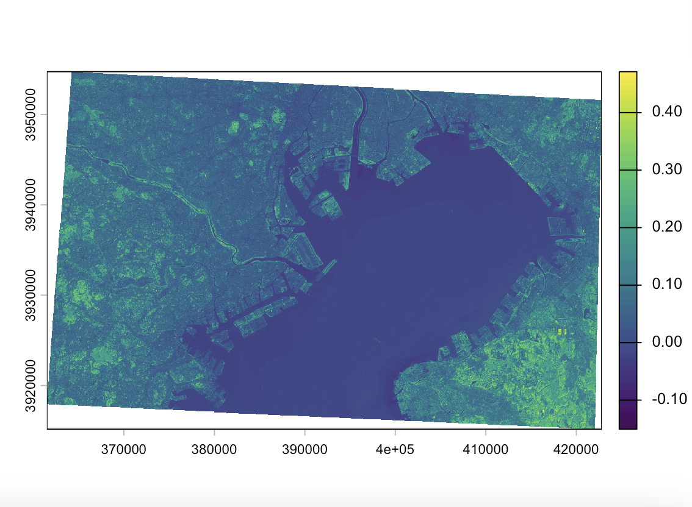
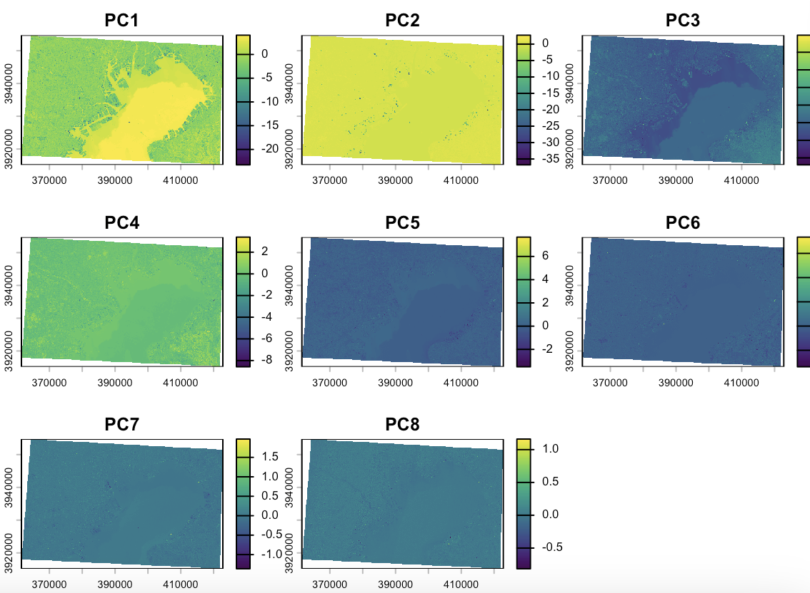

## Summary Content

### Reflections on Lecture: The Importance of Correction

This week's lecture focused on the idea that remotely sensed imagery should not be treated as a finished and fully reliable map, but as data that often require correction and careful interpretation before analysis. Using Landsat as the main example, the lecture explained how satellite images are produced and why different kinds of distortion can arise from sensor design, atmospheric conditions, topography and viewing geometry. In particular, the lecture emphasised the importance of radiometric correction: raw pixel values are stored as Digital Numbers (DN), which are unitless brightness values that vary by sensor and date, and converting them to spectral radiance (Lλ) using gain and bias coefficients makes the data comparable across sensors and time. The second half introduced enhancement methods such as NDVI, PCA and texture analysis. What I found most interesting was Andy's critical position that more complex processing does not automatically lead to better urban analysis.

### Connecting Theory to Practical Workflow

The practical helped connect these ideas to actual workflow. The main work was based on Landsat Collection 2 Level 2 surface reflectance data which, as discussed in the lecture, has pre-applied atmospheric corrections that make the data comparable across sensors and time. In practice, I found that the most difficult part was not the analysis itself, but preparing the data properly, including downloading the correct scenes, clipping them, handling shapefiles and resolving CRS issues.

### Lessons from Study Area Selection and Technical Limitations

A particularly important lesson from the practical was that the usefulness of the outputs depended heavily on the choice of study area. My first attempts did not produce interpretable results, either because the area was too homogeneous or the extent too large. After moving towards Tokyo Bay and reducing the size, the outputs became much clearer. In the final NDVI image, the contrast between water and surrounding urban surfaces became more visible (Figure 1),

and the PCA results also showed a clearer distinction between the bay and surrounding land (Figure 2).This demonstrated the power of dimensionality reduction. PC1 captures the highest variance, which in my case, effectively isolated the water features of Tokyo Bay from the dense urban fabric.

One limitation of this week’s work was that the outputs were highly sensitive to technical choices such as CRS, clipping extent and study area selection. This showed me that remote sensing analysis is not simply about applying techniques, but about making critical decisions about data preparation, spatial context and interpretability.

## Application

In the second part of this week’s learning, I looked at two application-based papers to understand how the methods introduced in the lecture, especially NDVI and PCA, are actually used in real urban remote sensing research.

The first paper was by Kaspersen et al. (2015). This study used Landsat vegetation indices, including NDVI, to estimate impervious surface fractions in European cities. I found this paper useful because it linked directly to both the lecture and the practical. In the lecture, NDVI was introduced as a simple but effective way of extracting specific land surface characteristics, and in the practical I also calculated NDVI myself. This paper showed that even a relatively simple index can be applied to a real urban problem, in this case the estimation of built-up and sealed surfaces. However, the paper also made clear that there are important limitations. Bare soil, shadow, and tree crowns covering impervious surfaces can all affect the results, which means that NDVI alone cannot fully represent the complexity of urban land cover. I think this matches my own experience in the practical, where the usefulness of the output depended a lot on the study area I selected.

The second paper was Deng et al. (2008). This paper used PCA to detect land-use change from satellite imagery collected at different times and from different sensors. I thought this was a good example of the feature extraction methods discussed in the lecture. In theory, PCA is useful because it reduces correlated image information into new components that can make patterns more visible. In my own practical work, PCA did help highlight the difference between water and surrounding urban land, especially in the first principal component. At the same time, I also found that the later components were much harder to interpret. This is why I found the limitation of PCA important. It may show differences clearly, but it does not automatically explain what those differences mean. In that sense, I feel PCA is more difficult to interpret than NDVI, even if it sometimes produces more visually interesting outputs.

Overall, these two papers helped me understand that the techniques introduced in the lecture do have real applications, but also clear limitations. This supports the lecturer’s point that adding more processing is not always the same as producing better analysis. What matters more is whether the method is actually useful for the question being asked.

## Reflection

This week's learning profoundly demonstrated that remote sensing is not merely a sequence of scientific steps but incorporates a significant element of "art", requiring technical mastery and judgment from the researcher. My experience shifting the study area to Tokyo Bay highlighted that effective analysis requires more than tool proficiency; it demands deep prerequisite geographic knowledge of the site to make informed context-selection decisions.
The lecture's deep dive into the mathematical "black box" of converting Digital Numbers (DN) to radiance was challenging, and I cannot yet claim complete mastery over every technical detail. However, I realized that understanding these underlying mechanisms is essential, even when using convenient Analysis Ready Data (ARD). It is this effort to understand the "why" behind the "what" that allows a researcher to identify data limitations and choose study areas with precision. Transitioning from a passive user of tools to a critical analyst who understands their inner workings is a vital shift. I am confident this mindset will be my strongest asset when moving toward highly automated platforms like Google Earth Engine, ensuring I remain focused on the logical extraction of urban truths rather than just computational convenience.

## Reference
