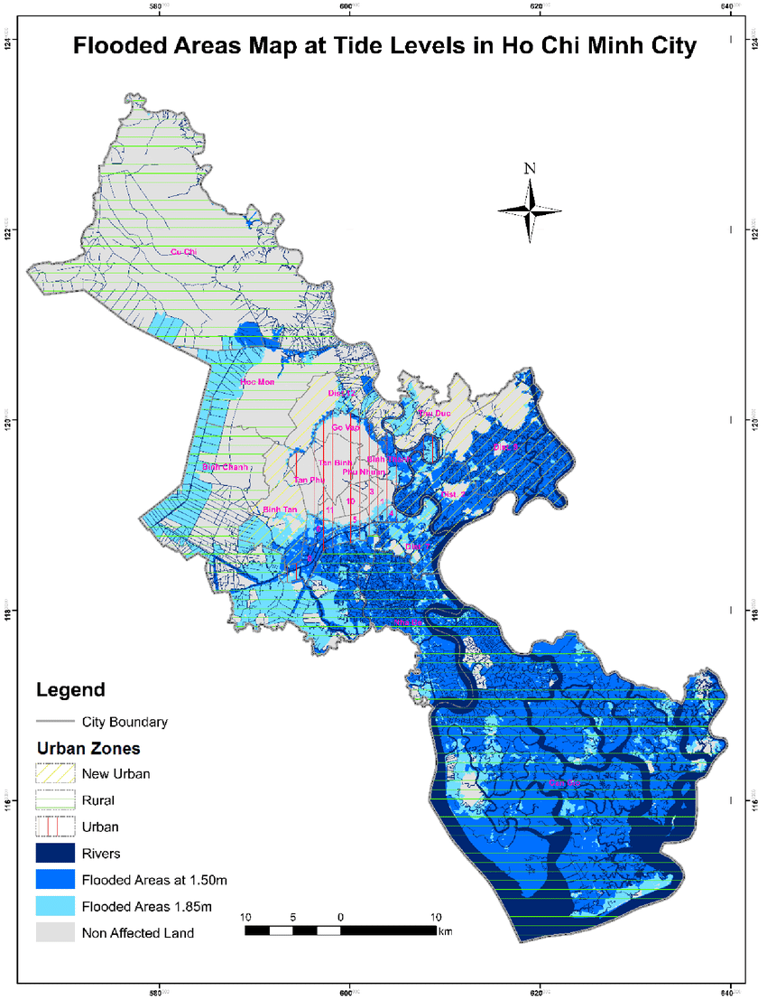
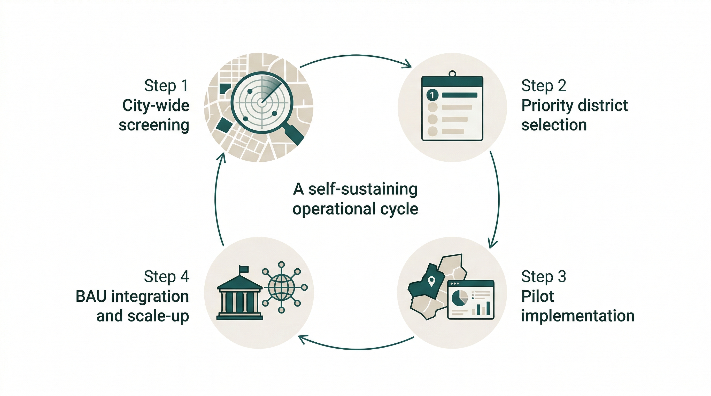

## Content Summary

### Connecting EO to policy

In this case, I would like to focus on land subsidence in Ho Chi Minh City. In the lecture, I learned that Earth Observation has many possibilities for visualising urban problems, but I also felt that it is important not only to **make problems “visible” but also to consider how such information can be used in policy**. The lecture also emphasised that, although remote sensing data can provide consistent spatial and temporal information when combined with other GIS datasets, many studies only demonstrate relevance to a problem and do not go far enough in addressing which areas should be prioritised, who should use the data, or at what stage it should be incorporated into the planning process.

### Why Ho Chi Minh City?

Ho Chi Minh City is a suitable case for thinking about the connection between EO and policy because it faces overlapping pressures of rapid urbanisation, flood risk, and the vulnerability of being a delta city. In particular, when considering cases such as Jakarta, where multiple urban stresses including land subsidence have contributed to discussions that go beyond urban policy and into broader national spatial restructuring, I felt that Ho Chi Minh City also needs to connect subsidence monitoring to policy decision-making before the problem becomes more severe. (Figure1)In that sense, it seems more appropriate to understand EO not as a technology that directly solves urban problems, but as one that creates an evidence base for policy decisions.

This approach directly aligns with the New Urban Agenda, which recognizes delta cities’ vulnerability, and contributes to SDG Target 11.5 by reducing disaster impacts on human settlements.

## Applications

### What EO data can contribute

In this case, I think the value of EO data lies not only in observing land subsidence itself, but also in contributing to decisions about where limited administrative resources should be directed first. Currently, Ho Chi Minh City largely relies on fragmented ground-based monitoring and conventional flood management policies that often focus on monitoring rather than proactive prevention. While these provide localized data, they lack the consistent spatial coverage needed for a city-wide strategic response. Technologies such as InSAR can advance this current approach by identifying where subsidence is most severe and how it evolves spatially and temporally through phase difference analysis.

If this information is then overlaid with GIS datasets such as flood risk, land use, and critical infrastructure, it transforms remote sensing from a mere observation tool into a decision-support system that assists in prioritising road repairs and drainage improvements. However, we must account for technical noise in dense urban areas, such as corner reflections and speckle, which can obscure patterns if not properly evaluated. For that reason, the results cannot simply be translated directly into policy without addressing the human and institutional skills required to interpret them.

### Proposal: building an educational and operational system

What I would like to propose is not simply the creation of a subsidence map, but the establishment of an educational and operational system through which this kind of analysis can be continuously updated locally. In an environment where there may be constraints on long-term external data access and management, it may be more sustainable not to provide a completed map from outside as a one-off product. Instead, I propose empowering local institutions, such as the Department of Urban Planning and Architecture (DPA), to enable local engineers and administrative staff to interpret EO data, visualise risk through GIS, set maintenance priorities, and evaluate results for themselves. If this improves the prioritisation of road repair and drainage works, and even slightly reduces wasted spending under limited budgets, then part of that savings could be reinvested into further training and future updates. In that sense, the role of EO in this topic may lie not simply in producing an “accurate map,” but in creating a locally sustainable decision-support system, as conceptualized in Figure 2.

## Reflection

### From technology to governance

Personally, thinking through this topic helped me understand more realistically what it means to use EO in policy. At first, I thought that for a problem such as land subsidence, the main priority was simply to create the most accurate map possible. However, through the lecture, I came to feel that what matters more is who uses that map, within what budgetary and institutional context, and at what stage of decision-making it is incorporated.

### What I learned

In the case of Ho Chi Minh City, **what is technically observable and what can actually function as policy are not the same thing.** That is why I think there is value not only in providing a one-off external analysis, but in building a foundation of knowledge and skills that can be updated locally over time. At the same time, I also recognise that this idea could remain idealistic, because in practice it must still confront constraints of institutions, budgets, human resources, and data sharing. What impressed me most in this week’s lecture was that **EO is not a neutral technology that simply reveals the truth. Its value depends on how it is used.** In that sense, policy week felt less about technology itself and more about governance.

## Reference

- World Bank (2015). *Vietnam - Ho Chi Minh City Flood Risk Management Project: Environmental and Social Impact Assessment*. Washington, DC: World Bank. Available at: https://documents.worldbank.org/en/publication/documents-reports/documentdetail/296891468330027063/vietnam-ho-chi-minh-city-flood-risk-management-project-environmental-and-social-impact-assessment

- Tran, T.N. (2014). *Improvement of Flood Risk Assessment under Climate Change in Ho Chi Minh City with GIS Applications*. Available at: https://www.researchgate.net/publication/283378874_Improvement_of_flood_risk_assessment_under_climate_change_in_Ho_Chi_Minh_City_with_GIS_applications

