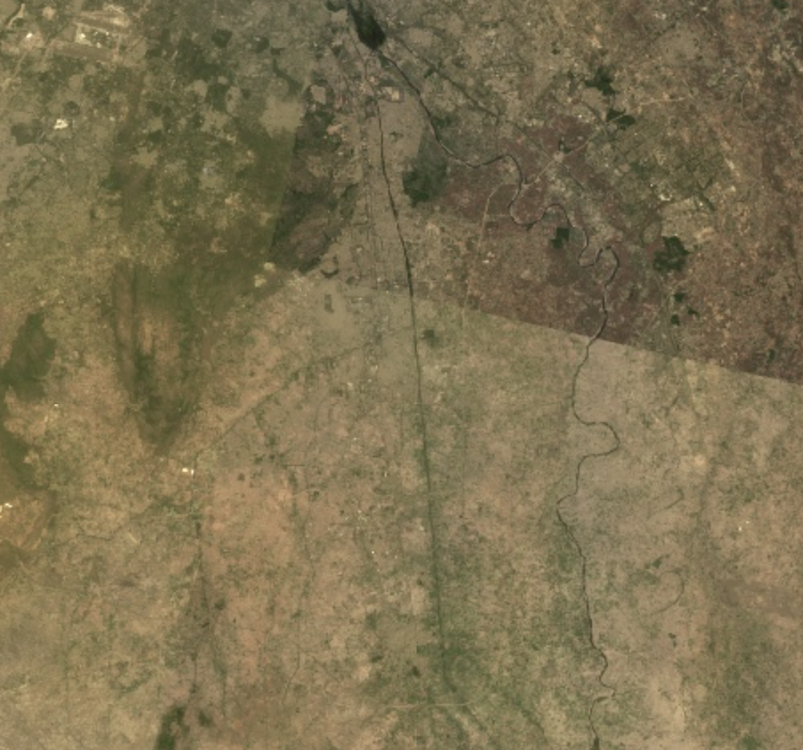

## Content Summary

### Transition to Cloud-Based Analysis: "Bringing the code to the data"

This week’s lecture introduced a transformative shift in geospatial workflows. While QGIS relies on manual operations and R enables local statistical rigor, Google Earth Engine (GEE) represents a fundamental paradigm shift. The core innovation is transitioning from downloading datasets to **"bringing the code to the data."** By executing scripts on Google’s cloud infrastructure, GEE allows near-instant processing of planetary-scale data regardless of local hardware specs. I perceive this as the "democratization of geospatial infrastructure."This efficiency is achieved through Proxy Objects, which are handles to data residing on Google's servers, preventing the local machine from being overwhelmed. However, this liberation implies new dependencies on external factors like Google’s resource quotas and network stability, necessitating a strategic mindset for managing computational resources.

### Statistical Aggregation: Creating Certainty via Reducers

In GEE, the "Reducer" is the essential mechanism for transforming vast raw data into meaningful information. Specifically, it converts an ImageCollection into a single Image through pixel-wise statistical aggregation .This method stacks hundreds of satellite images to perform pixel-wise statistical aggregation. Traditionally, researchers spent significant effort searching for a single "lucky" cloud-free image. However, **the Median Reducer converts this luck into mathematical certainty**. During the practical, I compared raw imagery with reduced results. Unprocessed images exhibited haziness from cloud reflectance, but the median function successfully restored the authentic spectral characteristics of the earth’s surface.

::: {layout-ncol="2"}

:::

Nevertheless, one must remain mindful that automated aggregation may discard rare but significant land-cover changes as mere outliers.

### Efficient Data Abstraction: PCA and the Evidence of the "97%"

::: {layout="[80,20]"}
I was particularly intrigued by GEE’s "on-the-fly" computation, which automates re-projection and resolution adjustments. This liberates analysts from tedious pre-processing, allowing more time for substantive geographical inquiry. In the practical, I applied Principal Component Analysis (PCA) to condense 19 spectral bands. While PCA computation occurs on the Server-side, the brief lag I experienced during rendering was a bottleneck where complex results were simplified for the Client-side browser display. A brief lag during rendering exposed the bottleneck occurring when the client-side attempts to display complex server-side results. Numerically, the top three components accounted for approximately 97% of the total variance, confirming that the remaining dimensions were largely noise.

{height=50%}
:::

While powerful, these **automated processes risk becoming a "black box."** Maintaining a critical stance toward mathematical verification is a prerequisite for truly harnessing the benefits of digital geography.

## Applications

The practical sessions highlighted that the core strength of Google Earth Engine (GEE) lies not merely in its computational speed or data accessibility, but in how these efficiencies enable deeper analytical inquiry. This perspective was reinforced by Phan and Kappas (@phan2020), who demonstrated that GEE’s capacity for rapid processing allows researchers to **shift their focus from the final classification result to the underlying methodological choices, such as image compositing strategies.** By comparing various compositing methods, they showed that the way input imagery is assembled significantly influences classification accuracy. For me, the significance of this study is that GEE's speed allowed the researchers to move beyond "getting a result" to asking a more meaningful question: What kind of image composite best represents this specific landscape? Phan and Kappas reported that while complex time-series data yielded high accuracy, a carefully selected median composite performed similarly, suggesting that the choice of compositing method is itself a critical research question.

This concept of "methodological choice as analysis" became even clearer through Zhang et al. (@zhang2021). Their study compared different annual composites created with GEE reducers for urban mapping and found that a combination of multiple reducers outperformed any single reducer. This helped me realize that reducers are not just time-saving functions, they **represent analytical decisions about what constitutes "signal" versus "noise" within a massive image archive**. This directly mirrors my experience in the practical, where the median reducer effectively mitigated cloud interference to produce a clearer image.

However, this process also demands caution. While reducers improve readability and accuracy, they risk treating short-term environmental changes or rare phenomena as statistical outliers to be removed. Thus, GEE does not make the analyst less necessary. Rather, it demands more active judgment regarding processing choices and the interpretation of results. Ultimately, the true value of GEE lies in freeing the researcher from technical bottlenecks, thereby providing the time to compare methods and think more critically about the geographical meaning of the output.

## Reflection

This week provided my first clear understanding of the practical value of cloud-based systems. While I had encountered the term "cloud" during job hunting, I had never fully grasped its direct relevance to my own analytical workflow. Having previously struggled with software performance due to limited local hardware specifications, I found it particularly meaningful that Google Earth Engine (GEE) decouples analysis from physical hardware constraints by "bringing the code to the data" on remote servers. In this sense, GEE represents more than just a convenient tool. It is a prime example of the **"democratization of data analysis," making spatial inquiry accessible to anyone without prohibitive infrastructure costs.** However, GEE demands a fundamental shift in mindset beyond just speed. Rather than manipulating data directly, I learned that I am interacting with Proxy Objects, which are handles to data residing on Google's servers. This required me to restructure my geographical logic entirely. A significant challenge was the transition from procedural loops to functional mapping, which allows GEE to distribute processing efficiently across multiple machines in parallel . Furthermore, the fact that scale or resolution is determined by the output rather than the input was a revelation. Understanding how GEE selects the appropriate level from an image pyramid and resamples data highlighted my responsibility as an analyst to critically evaluate the scale at which results are calculated. I also recognized that as the process becomes more seamless, it risks becoming a "black box." Because results can be generated with such ease, it becomes increasingly difficult to personally verify the methodological soundness of every underlying calculation. This has reinforced my belief that **continuing to master tools like R and QGIS remains essential for understanding fundamental processes**, rather than simply accepting automated outputs. For me, this week was valuable not only for introducing an advanced technology but for prompting a serious reflection on how to use such power critically and responsibly.
