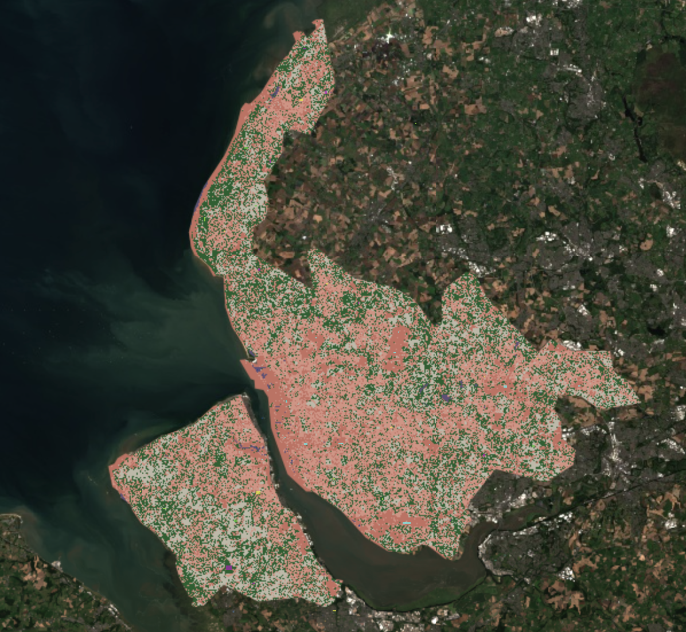
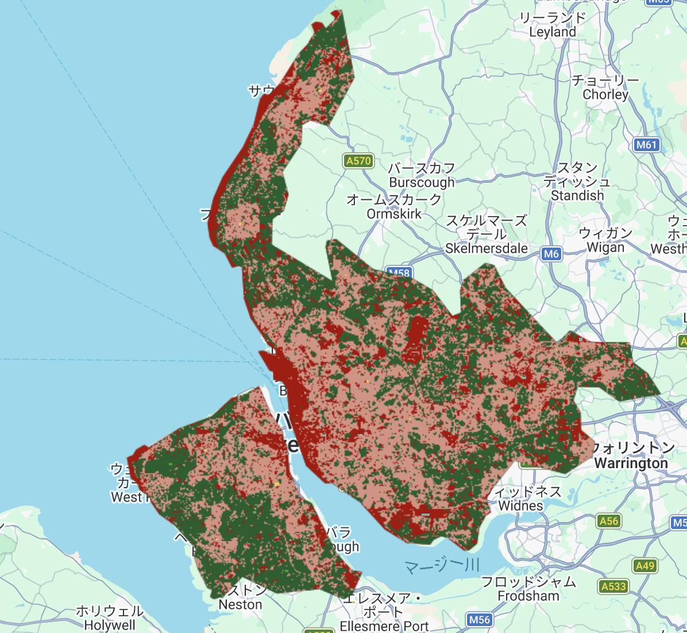

## Summary Content
### 1. Reflection on Course Content and Personal Insights

When I first encountered Google Earth Engine (GEE) last week, I was amazed by the convenience of not having to prepare massive map datasets myself. This week, that impression deepened further. Initially, I thought land cover classification was a simple task of "sorting land into types," but I have learned that it is actually a highly sophisticated **"translation process"** that converts spectral information captured by satellites into meanings understandable to humans.

The core of this week’s learning was "Supervised Machine Learning." Unlike "Expert Systems" where humans define the rules, the mechanism where AI autonomously extracts patterns from data overlapped with what I have recently been learning in my DSSS (Data Science for Spatial Systems) module. This provided an excellent opportunity to deepen my understanding. While the logic of "Decision Trees" was clear, I gained a much deeper "story-like" understanding of the risks of **"Overfitting,"** where a model becomes too attached to specific data and loses its generalizability.

However, the most striking part of the lecture was the debate between **Pixel-based vs. Object-based (OBIA)** analysis. I feel that no matter how powerful an analytical tool is, if the unit of analysis does not resonate with the audience, the credibility of the results will be weakened. I have categorized the two approaches as follows:

* **Pixel-based analysis:** Suitable for capturing phenomena that change in a gradient without clear boundaries, such as vegetation indices or land surface temperature, or when a quick understanding of broad trends is required.
* **Object-based analysis:** Necessary for high-resolution imagery where elements like roofs, roads, and shadows are difficult to distinguish by color alone, requiring higher precision based on shape and contextual information.

### 2. Muddy Trial and Error in Practice

In the practical session, I proceeded with the land cover classification of Liverpool using GEE. Actually performing the analysis allowed me to experience the "muddiness" of the process. While I was impressed by the "lightness" of the workflow—where I could focus on a specific location with a single click—I was soon troubled by GEE’s computational limits.

In my attempt to be precise while manually inputting polygons, I encountered the **"5000 elements" error**. Once I managed to bypass this limit, the resulting map was unexpectedly different from the example, with many grey areas scattered throughout. I learned that this occurs when the AI cannot accurately determine the elements, resulting in an ambiguous classification.

Furthermore, when I attempted to verify the accuracy, I was blocked by the **"One-class error"**. In an industrial city like Liverpool, land use is heavily biased. This made it difficult to sample all classes equally for the split-validation, leading to the disappearance of rare classes and the breakdown of the error matrix calculation.

### 3. Strategic Decisions and Conclusion

To break through this stalemate, I made the strategic decision to consolidate the classes into three primary categories, simplifying the model to eliminate the "grey noise." To prevent data loss during splitting, I deliberately chose to use **the entire sample for both training and validation (Resubstitution)** to confirm the internal consistency of the model. And thankfully, the grey part disappeared.

Ultimately, I detected a very high accuracy of 99.7%. However, I am fully aware that this figure contains **"Optimism Bias."** Through this experience, I was able to learn the difficulty of class setting and, most importantly, the challenges of the non-programming aspects—the muddy, human task of drawing balanced polygons.

## Applications

My primary takeaway from this week is that the choice between treating land as "pixels" or as "objects" is not merely a technical preference; it directly relates to the **"Geographical Integrity"** of the researcher—what kind of urban "truth" one intends to reflect.

**Comparison of Macro and Micro Perspectives:**
When the objective is to grasp broad urban trends or complex interrelationships between multi-source data, macro-level analysis serves as a powerful tool. The study by Zhao et al. (2020) presents a method for structuring cities not just as a collection of pixels, but as a "Knowledge Graph". This approach prioritizes the "semantic relationships" and network structures behind individual data points. Rather than fixating solely on the values of isolated pixels, it highlights the importance of capturing a macro-perspective of how urban functions, land use, and resident mobility evolve over time.

In contrast, Rajji et al. (2022) provide a micro-level perspective focused on the physical geometry of the city. They estimate building heights from high-resolution imagery, but the key here is their redefinition of "shadows"—often treated as mere noise—as essential structural data associated with a building "object". Reflecting on my practical session, I believe the "ambiguity (grey areas)" that troubled me could have been resolved more accurately if I had treated those areas not as pixel points, but as objects with specific contexts, such as shape and solar orientation.

**Synthesis and Future Implementation:**
Connecting these two perspectives is the concept of **"Analytical Integrity"** that I arrived at through the practical exercise. While the grey noise I encountered could not be attributed to a single definitive cause, that very ambiguity was a vital experience that forced me to realize the limitations of relying solely on pixel-based numerical values.

## Reflection

Reflecting on this week's module, my experience with Google Earth Engine (GEE) began with an initial admiration for its computational efficiency. However, through the practical session, it transformed into a "muddy" realization of the responsibilities that a spatial analyst must carry. Despite the difficulties, I now recognize that this process of land cover classification is an essential foundation for providing the logical evidence needed to inspire people to take action. This was my original motivation for joining this master's course, and I believe this is a fundamental skill I must master.

In the practical session, I faced the challenging task of manually creating training polygons rather than relying entirely on a fully automated AI analysis. While this is not an easy skill to master, the use of such machine learning models is directly connected to "reproducibility," which is a value I prioritize in spatial analysis. The fact that AI's computational power alone is insufficient for high reproducibility, and that appropriate human intervention and geographical interpretation are required, proves why human judgment remains essential even as data analysis becomes more advanced.

In my future research on urban spatial inequality, I will not view "grey noise" as a failure of the tool, but as a signal to reconsider the scale of my analysis. Whether I am examining macro-level disparities across an entire city or micro-level densification in specific neighborhoods, I must choose the scale that best fits the social reality. I am convinced that selecting the most appropriate scale for the context is the most important lesson I learned this week and a true practice of geographical integrity.
---
