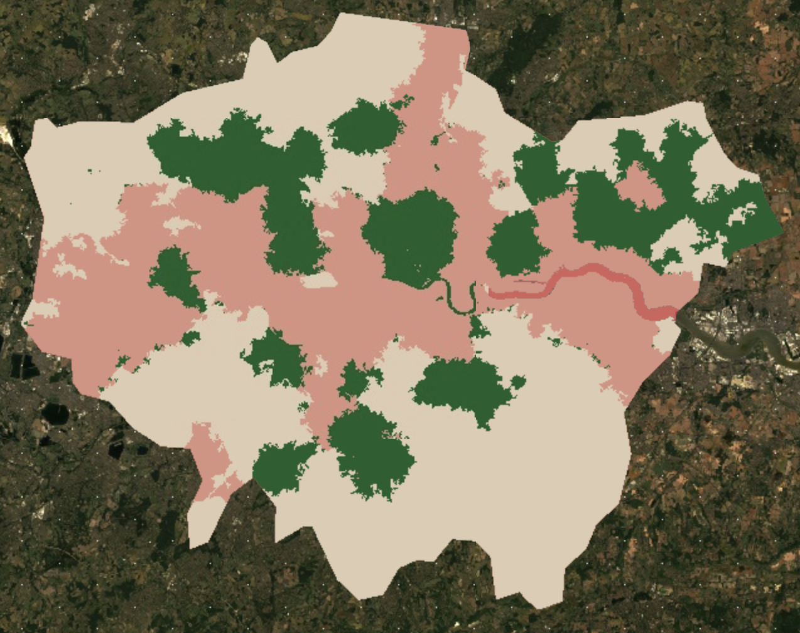

## Content Summary

### Accuracy Validation and Optimism Bias

This week’s learning began with a theoretical critique of how classification accuracy is validated. The lecture highlighted the "Optimism Bias" inherent in the Resubstitution method, where using the same samples for training and validation leads to artificially high results. In the practical, I addressed this by moving away from the 99.7% accuracy achieved in previous sessions, instead implementing a 70:30 Random Split for validation. This transition from "internal consistency" to "predictive power" ensured that the final overall accuracy of 87.5% was a scientifically robust and honest reflection of the model’s performance in a complex urban environment like London.

### Object-Based Image Analysis (OBIA) via SNIC

A major conceptual shift was the move from pixel-based methods to Object-Based Image Analysis (OBIA). Pixel-based classification, while straightforward, often results in "salt-and-pepper noise" because it ignores the spatial context of neighboring cells. Following the lecture’s emphasis on superpixels, I implemented the Simple Non-Iterative Clustering (SNIC) algorithm in the practical. By grouping adjacent pixels with similar spectral properties into statistical "objects," I was able to preserve the structural integrity of the urban fabric, such as the clear delineation of the River Thames and distinct urban blocks, which would have been fragmented under a pixel-only approach.

### Spatial Autocorrelation and Strategic Sampling

The lecture introduced Tobler’s First Law of Geography, which states that near things are more related than distant things. This principle of spatial autocorrelation poses a challenge for sampling, as clustered data can lead to redundant information and over-fitted models. To operationalize this theory during the practical, I developed a strategic sampling plan by dividing the metropolis into five sectors: North, South, East, West, and Central London. By ensuring that training plots were distributed across these varied geographical contexts, the classifier captured a representative range of spectral signatures, thereby mitigating the risks associated with spatial autocorrelation.

## Application

The core of this week's learning lies in understanding how the choice between object-based and pixel-based methodologies reflects a researcher's underlying narrative and intent. Choosing whether to treat land as a collection of independent pixels or as a series of meaningful objects is not merely a technical preference. It relates directly to the "Geographical Integrity" of the researcher and which version of urban "truth" one intends to manifest. In the context of analyzing economic-geographical inequalities, this choice determines whether we perceive poverty as a fragmented spectral value or as a structural, spatial manifestation of social exclusion.

When examining urban inequality through a micro-structural lens, the differentiation between these two approaches becomes evident in how they define social stratification. Kohli et al. (@kohli2013) demonstrate the power of Object-Based Image Analysis (OBIA) by defining slums as physical "objects" characterized by specific geometries and textures, proving that such structural identifiers can be transferred across diverse urban contexts like Kenya and India to pinpoint marginalized areas. Conversely, Sathyakumar et al. (@sathyakumar2019) focus on the relationship between socioeconomic status and the distribution of urban green space, showing how environmental benefits can be unevenly distributed across urban areas. While Kohli's OBIA approach is superior for capturing the morphological "essence" of informal settlements, it risks sensitivity to local definitions. Meanwhile, the pixel-based indicators highlighted by Sathyakumar offer a more comparable way to quantify environmental inequality, even if they may overlook lived environmental nuances such as how building shadows affect the microclimate of a neighborhood.

Synthesizing these perspectives reveals that the true value of classification lies in its ability to transform raw numerical data into a map of inequality that informs policy. My experience with the misclassification of shadows during the practical session was a crucial realization that ambiguity in data is often where the most significant urban stories are hidden. Treating those shadows not as noise but as contextual objects can reveal density and living conditions invisible to simple spectral analysis. By integrating these micro-structural insights with macro-temporal patterns, such as monitoring long-term urban sprawl or post-disaster recovery, remote sensing evolves from a mere observation tool into a powerful political instrument. For my future project, this shift from pursuing perfect accuracy to extracting social context will be essential in identifying the hidden variables of urban inequality and translating them into actionable evidence for fairer city planning.

## Reflection

This week’s transition from basic classification to advanced spatial logic has taught me that the quality of a remote sensing model depends less on the algorithm itself and more on the researcher's deliberate process of teaching "urban reality" to the machine. Building upon last week’s foundational pixel-based classification, the implementation of OBIA and SMA has shifted my perspective. The choice between "pixels" and "objects" is no longer just a technical setting. It has evolved into a fundamental question of how we should perceive the resolution of a city to uncover hidden socioeconomic truths.

A critical takeaway from the practical session was confronting the inherent limitations of satellite imagery, such as the persistent ambiguity caused by shadows and blurred boundaries. Paradoxically, acknowledging that satellite data is not "100% perfect" allowed me to appreciate the immense flexibility of interpreting visual information through multiple analytical lenses. While these technologies are powerful for capturing macro-scale dynamics, such as long-term urban evolution or economic trends. I have reaffirmed that they cannot replace the "worm’s-eye view" gained from walking the streets. The realization that we require both the "bird’s-eye view" of remote sensing and the "ground truthing" of field observation to achieve "Geographical Integrity" is perhaps my most significant intellectual growth this week.

Looking ahead, I am convinced that mastering the precise analysis of night-time lights, road network transitions, and urban development stages is an indispensable skill for my commitment to redressing economic inequality. The ability to implement machine learning to transform visible disparities into empirical evidence provides a formidable weapon for evidence-based policy advocacy. However, this journey has also raised a new inquisitive dialogue: must we treat pixels and objects as a strict dichotomy? I am increasingly interested in pursuing a "hybrid perspective" that retains the spectral richness of pixels while integrating the geometric context of objects. Such an approach could open a new frontier in analyzing complex phenomena like urban inequality, moving beyond sterile metrics toward a more human-centric spatial science.
